 

 

## 👋 About me

I'm a full-stack developer who likes owning a product end to end, from the database schema to the last pixel. I write backends in **Java and Spring Boot**, build frontends in **React and Next.js**, and ship them to production.

- 🚀 Building **[YUSR AI](https://yusr.co.in)**, a WhatsApp CRM SaaS for Indian businesses, live in production with subscription billing
- 🧠 Working on AI features: RAG over business catalogs, Gemini-powered assistants, n8n automation
- 🔐 I care about the unglamorous parts too: auth, rate limiting, secret scanning, CI, and tests
- 🌱 Currently going deeper into microservices and system design

 

## 🛠️ Tech stack

<table>
  <tr>
    <td width="140"><b>Backend & data</b></td>
    <td></td>
  </tr>
  <tr>
    <td><b>Frontend</b></td>
    <td></td>
  </tr>
  <tr>
    <td><b>Tools & DevOps</b></td>
    <td></td>
  </tr>
</table>

 

## ⭐ Featured projects

<table>
  <tr>
    <td></td>
    <td></td>
  </tr>
  <tr>
    <td></td>
    <td></td>
  </tr>
</table>

 

## 📈 GitHub activity

<picture>
  <source media="(prefers-color-scheme: dark)" srcset="https://raw.githubusercontent.com/Farhan7-tech/Farhan7-tech/output/snake-dark.svg" />
  <source media="(prefers-color-scheme: light)" srcset="https://raw.githubusercontent.com/Farhan7-tech/Farhan7-tech/output/snake.svg" />
  
</picture>

 

## 🤝 Let's work together

I'm open to **backend and full-stack roles** and **freelance projects**. The best way to reach me is on **[LinkedIn](https://www.linkedin.com/in/mohd-farhan-79429624b)** or through my **[portfolio](https://mohdfarhan.framer.website/)**.

